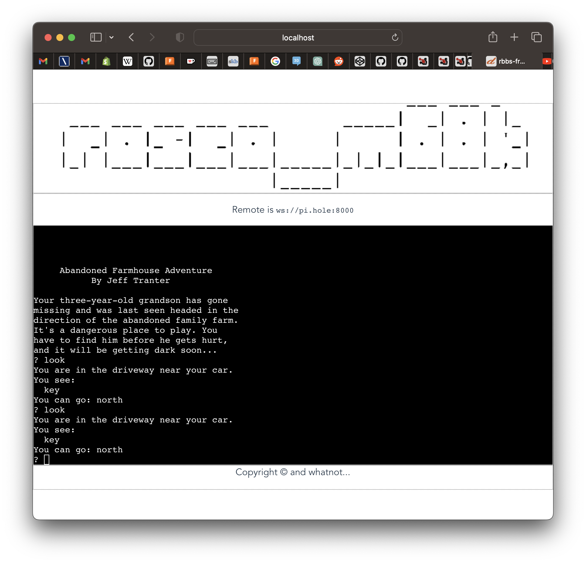

# rbbs - rosco_m68k BBS or something

## What?

The idea is to hook up a real rosco_m68k and have it serve a BBS over the 
Internet.

Because what could possibly go wrong?

More broadly it'll let you hook up anything that uses serial for IO (and can
present that serial as a character device on a Unix machine).

## Why?

Why not? 

It'll be fun.

## What's involved?

The project comprises a [Vue.js frontend](./rbbs-frontend) to let users do things
with the connected device, and a [websockets server](./rbbs-ws) that takes care 
of letting one user at a time connect to that device.

I run the websockets server on a raspberry pi, with the rosco plugged into that
using a standard FTDI USB adapter. You can also just run both the server and 
the frontend on your main machine of course.

This is all pretty scrappy right now, lots of stuff is hacked in and hardcoded.
You'll at least want to change the `remote` attribute on the `<RemoteTerm>` 
element in [App.vue](./rbbs-frontend/src/App.vue) I expect.

## License

Copyright (c)2023 Ross Bamford & Contributors
[MIT License](LICENSE.md)

